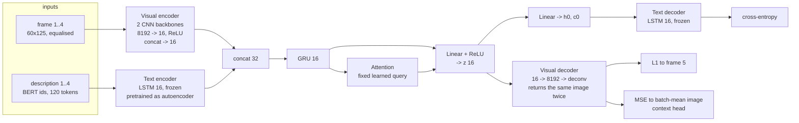
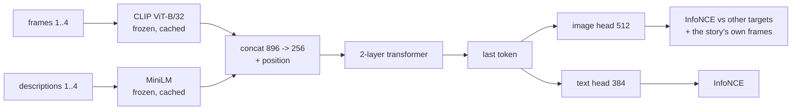
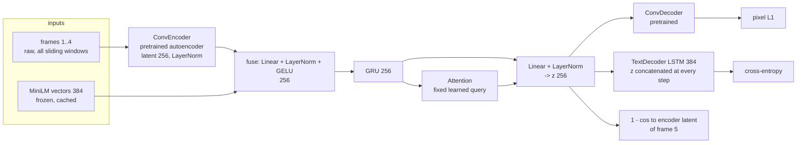
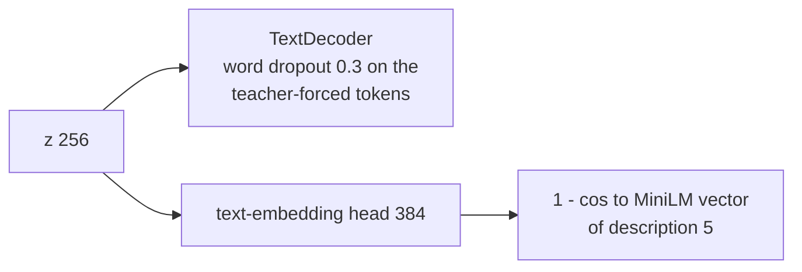
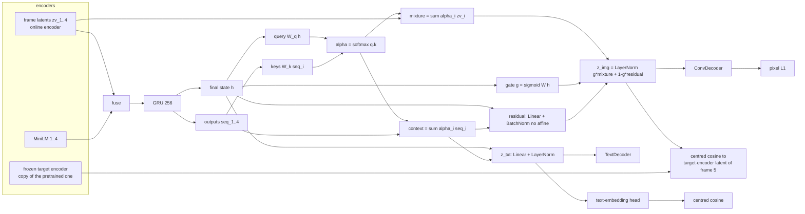
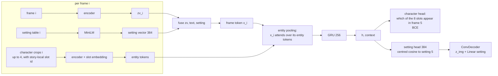

# How the StoryReasoning predictor evolved

The task: given four consecutive movie frames and their descriptions from a StoryReasoning
story, predict the fifth frame (image) and its description (text). This document follows the
architecture from the notebook baseline through every change, with the reasoning and evidence
that led to each one. All numbers are from `ASSESSMENT.md`, measured on this laptop; the
scripts that produced them are named in each section.

Two constants throughout: frames are resized to 60x125 (the notebook's choice), and the image
loss is pixel L1. Everything below is what can and cannot be done under those two choices.

---

## 0. Baseline: the notebook architecture

**Components.** A from-scratch CNN encoder split into a "content" and a "context" backbone
(the idea was to separate the frame from the mean pattern), each ending in a Linear(8192, 16)
with a ReLU; a frozen LSTM text autoencoder with 16 hidden units, pretrained to copy
descriptions; a GRU(16) over the four fused (image, text) vectors; an attention module with
one learned query vector; a projection to a 16-d latent with a ReLU; a deconvolutional
decoder; and the frozen LSTM decoder driven only through its initial state.

**Losses.** L1 between the decoded image and frame 5; MSE between a second decoded image and
the mean of all input frames in the batch (the context head, added later to try to absorb the
mean pattern); cross-entropy on the description; ReID, grounding and contrastive losses on
character crops from the chain-of-thought boxes.

**What it produced.** A uniform brown-grey image for every input, and generic text. The loss
print showed only the last batch of each epoch, so no trend could be read.

**Diagnosis** (`diagnostics/`, section 3 of the assessment). Several independent problems:

| problem | evidence |
|---|---|
| The decoder returned the same tensor for both heads, so the context loss trained the only image output to be the mean image | `max(content - context) = 0` |
| L1 on a next frame from a different shot is minimised by the per-pixel median image | constant median 0.155, copy previous frame 0.174 |
| The output was constant regardless of input | spread across inputs 0.0000; validation L1 0.2586 vs a floor of 0.2580, unchanged from epoch 1 |
| The 16-d ReLU latent feeding the decoder was constant with 44 % dead units | measured from epoch 1, with or without the context loss |
| Histogram equalisation made the target harder | median floor 0.155 raw vs 0.241 equalised |
| The grounding losses were numerically zero | one valid ROI per batch gives a 1x1 InfoNCE |
| The refactored `train.py` crashed on the first batch | a `keepdim=True` in the context target |

The hypothesis that a per-position noise pattern caused the blob was tested and rejected:
there is a reproducible per-position tint of about one gray level, twenty times smaller than
the frame-to-frame variation, and the blob is the median image, identical for every position.

---

## 1. Detour: what is learnable at all (proof of concept, `poc/`)

Before fixing the pipeline, the question "is this task learnable on a laptop" was answered
in embedding space, where the loss cannot be satisfied by a blob.

Result on 2,974 held-out windows: the true next frame is ranked first among all candidates
6.8 % of the time (chance 0.03 %, copy-the-last-frame 2.3 %) and in the top 10 in 40 %; text
8.7 % and 58 %. Two minutes of training. Also learned here: an L1 pixel decoder given the
*true* target embedding still draws a blurry image with the right colour and layout (L1 0.116
vs 0.153 for a constant), so blur is a property of the pixel loss, not of the predictor; and
each modality mostly predicts itself, the fusion added nothing with this much data.

---

## 2. v2, first pass: the pipeline with the fixes

The pipeline shape was kept on purpose, so that each component could be taught as part of a
larger system. Every change maps to a diagnosed problem.

| change | reason | what it entails |
|---|---|---|
| Pretrain the visual autoencoder (`v2/pretrain_visual.py`) | the encoder had never learned to represent a frame; the notebook's pretraining cell was a To-Do | reconstruction L1 on all 31k training frames; 12 epochs, 1 minute; val L1 0.040 vs floor 0.152 |
| Latent 16 -> 256, ReLU -> LayerNorm | the 16-d ReLU latent was constant and half dead | wider bottleneck that cannot die |
| Drop the context head and equalisation | both pushed toward the blob | one image output, raw frames |
| MiniLM as text encoder (LSTM kept as an option) | a frozen 16-d LSTM autoencoder cannot carry a 100-token description | frozen 384-d sentence vectors, cached once |
| Text decoder conditioned at every step, 384 hidden, trained jointly | the frozen decoder got only a 16-d initial state | the latent is concatenated to each token embedding |
| Latent-space target next to pixel L1 | pixel L1 rewards the blob; a latent target is informative where pixels are not | cosine between the predicted latent and the encoder's latent of frame 5 |
| All sliding windows, split by story | 5x more training windows; no story leaks between splits | 13.6k train / 3.4k val / 3.0k test windows |
| Logging against floors | the notebook's failure was invisible without them | per-epoch validation L1 next to the median and copy-last floors, prediction spread, retrieval, shuffled-condition CE |

**Result.** Images became input-specific for the first time: L1 0.130 against floors of
0.151 and 0.170, spread 0.10 instead of 0.00, and a prediction fits its own target far better
than a random other one (0.130 vs 0.166). Text did not: cross-entropy was 3.061 with the true
latent and 3.070 with a shuffled one (`v2/probe.py`), i.e. the decoder had become an
unconditional language model and every window decoded to the same sentence.

---

## 3. v2, second pass: making the decoder use its condition

| change | reason | what it entails |
|---|---|---|
| Word dropout on the teacher-forced tokens | a conditional LSTM ignores its condition when the previous words predict the next one well enough (Bowman et al. 2016) | 30 % of input tokens replaced by [UNK] during training |
| Text-embedding head with a cosine target | the latent had no reason to carry the description | one linear head, trained toward the MiniLM vector of the next description |

**Result.** The condition is used (gap 0.10 nats), generated text varies with the window and
tracks the scene, and the latent retrieves the right description in the top 10 of 2,974 for
37 % of windows. Two new findings drove the next stage: image-latent retrieval collapsed from
7.5 % to 0.9 % while the training latent loss fell to 0.035 (the fine-tuned encoder shrank
its latent space toward the mean, which satisfies a raw cosine target trivially), and the
predicted latents were nearly identical across windows (pairwise cosine 0.98), a large
constant plus a small input-dependent part that a linear head can read but the decoders
mostly cannot.

---

## 4. Stage A: fix the latent

| change | reason | what it entails |
|---|---|---|
| Remove the constant component of the residual | predicted latents had cosine 0.98 between windows | BatchNorm without affine on the residual path |
| Content-dependent attention | the notebook's attention has one fixed query, so it can only learn a positional prior; the A-B-A-B editing pattern needs a query that depends on the sequence | query from the final GRU state, keys from the GRU outputs |
| Mixture of frame latents plus residual, with a gate | the fusion should be able to *select* an input frame, in the space the decoder was pretrained to invert, rather than redraw it from scratch | `z = g * sum(alpha_i zv_i) + (1 - g) * residual`; the weights and the gate are inspectable |
| Separate text latent | one vector served pixels, image latent and text embedding, and the heads competed (the frozen-encoder run in the assessment showed it as a trade-off) | own projection for the text side |
| Frozen target encoder and centred cosine | encoder latents share a large mean (raw pairwise cosine 0.31; MiniLM 0.38): a raw cosine loss is nearly blind and is satisfied by shrinking latents toward the mean, which is what the fine-tuned encoder did | the latent target comes from a frozen copy of the pretrained encoder; losses and retrieval metrics subtract the batch mean of the targets |

**Result.** Centred latent cosine between windows 0.03 (constant component gone); image-latent
retrieval 6.1 % and text retrieval 49 % *in the same run*; the decoder's dependence on its
condition doubled (gap 0.19 nats); spread 0.12. The near-copy windows got slightly worse
(0.065 -> 0.077): the attention learned the positional prior (mean weights 0.12 / 0.26 / 0.36
/ 0.26, frame 3 first, the editing rhythm) but not per-window selection (argmax hits the
closest input 29 % of the time, chance 25 %, flat across epochs), so the mixture averages the
four frames. The mechanism is wired but nothing in the loss trains the selection.

---

## 5. Stage B: the text head

| change | reason | what it entails |
|---|---|---|
| Condition the decoder on (z_txt, predicted text embedding) | the embedding head is trained to be discriminative; give the decoder that vector too | cond_dim 256 -> 640 |
| Nucleus sampling with a repetition penalty for generation | greedy decoding returns the corpus mode: 34 % of the 44k training descriptions contain "the tension", 2.4 % open with "the tension reached a", and the modal path through those phrases is the same for every window | `top_p 0.9`, temperature 0.8, penalty 1.3 |

**Result.** No measurable change in the metrics (gap still 0.20). Sampling replaces the one
repeated sentence by varied, mostly readable descriptions with names and settings. The
"memorised story" hypothesis for the repeated sentence was tested and rejected: each of its
5-word pieces appears in 40 to 1,000 training descriptions and no single description shares
more than a third of its 4-grams.

---

## 6. Stage C: the annotations

The chain-of-thought gives, per frame, a characters table (persistent ID, name, description,
emotions, actions, bounding box), an objects table and a setting table (location, lighting,
time, mood), and the story text is grounded to those IDs. `v2/precompute_annotations.py`
caches 50k character crops, story-local character slots and a MiniLM vector per setting
table.

| change | reason | what it entails |
|---|---|---|
| Setting vector as an input and as a target; predicted setting conditions the image decoder | brightness and tint are the only pixel properties predictable across a cut, and the setting table names them | 384 extra input dims; a setting head; `z_img += Linear(setting)` |
| Entity tokens pooled into each frame token | the story lives in who is in the frame; attention over entities, not only frames | encoder on the crops, slot embedding, one attention pooling per frame |
| Structured target: which characters appear in frame 5 | the most predictable aspect of the next frame, with an honest metric | multi-label head over 8 slots, masked to the story's characters; F1 against "same as frame 4" and "all seen so far" |

**Result.** Image L1 0.133 (best of the three stages), image-latent retrieval 7.6 %, text
retrieval 43 % (the extra losses cost it 6 points). The character head reaches F1 0.41 at its
best threshold, equal to the "everyone seen so far" baseline and below "present in at least
two of the four inputs" (0.47): it learned the prior, not the pattern. Two data facts fell
out: frame 3's characters predict frame 5's better than frame 4's (0.44 vs 0.38), the editing
rhythm again; and per-character history is the signal, which a head on the pooled state cannot
exploit slot by slot. The setting conditioning had no visible effect. Training the same model
for 30 epochs made every metric except the language model's worse (image L1 0.140, text
retrieval 40 %); validation image L1 is lowest at epoch 1 and rises from there, so the pixel
head overfits 13.6k windows immediately and 12-15 epochs is the budget.

---

## 7. Supervised attention (tried and reverted)

The closest input is known at training time, so the attention was trained toward it and the
gate toward "a close input exists". Selection did improve (argmax accuracy 29 % -> 52 % on
near-copy windows, gate 0.67 on near-copy vs 0.38 on cuts) and image L1 reached 0.130, but
text retrieval fell from 49 % to 16 %: the query and the gate are computed from the same GRU
state the text heads use, and the supervision reshaped it. The pixel gain is also bounded:
decoding the best input's latent reproduces it at 0.04 and that input is up to 0.06 from the
target, so the latent route cannot go below about 0.06 on those windows, against 0.041 for
copying pixels. Kept as a flag (`--attn-weight`, `--gate-weight`), not as the default; if
pursued, the selection should be computed from pairwise similarities between the frame
latents rather than from the shared sequence state.

---

## 7b. Pretrained text decoder, discriminative learning rates, retrieval-based selection

Three changes with one motive, protect what was pretrained and select what has trained:
the text decoder is pretrained as an unconditional language model on all 31k descriptions
(`v2/pretrain_text.py`, perplexity 17.9) and loaded before conditional training; the
pretrained image encoder and decoder train at 0.1x the learning rate and the decoder's language
layers at 0.3x; checkpoints are selected on validation retrieval rather than image L1 (the
image-L1 rule had picked epoch 1, a model whose other heads were untrained). Result: text
cross-entropy 2.75 instead of 3.30 and readable sampled descriptions, text retrieval 46 % (C)
and 52 % (A), image L1 0.131 / 0.132. The new reconstruction monitor shows the autoencoder
still drifts to 0.080 from its pretrained 0.040 even at the low rate, which points to the
next change: a reconstruction term during sequence training.

## 7c. Reconstruction term, pixel copy path, perceptual loss

Two final image-side runs. A reconstruction loss on the target frame during sequence training
keeps the fine-tuned autoencoder at its pretrained 0.041 instead of drifting to 0.080, at no
cost to anything else. A pixel copy path (attention-weighted blend of the four inputs, per-pixel
gate against the generated image) improves the near-copy windows slightly (0.073 -> 0.071) and
its gate opens more on those windows than on cuts (0.28 vs 0.16), as the ceiling analysis
predicted. A VGG perceptual loss (relu2_2..relu4_3) beats the blob in feature space by a small
margin (0.083 vs 0.086) and leaves pixel L1 at its best (0.131) and the images as smooth as
before: calibration showed that no VGG layer set ranks a real but different shot above the blob,
so a feature distance still averages over the plausible next shots where the shot cuts. That
closes the L1-family image head; anything sharper needs a loss over samples (adversarial,
diffusion) or the retrieval formulation.

## 8. Where it stands

| test split, 2,974 windows | notebook | v2 pass 1 | v2 pass 2 | A | B | C |
|---|---|---|---|---|---|---|
| image L1 (floors: median 0.151, copy last 0.170) | at floor | 0.130 | 0.132 | 0.135 | 0.134 | 0.133 |
| prediction spread (target 0.204) | 0.000 | 0.100 | 0.101 | 0.124 | 0.125 | 0.123 |
| image-latent retrieval top-10 | n/a | 7.5 % | 0.9 % | 6.1 % | 6.8 % | 7.6 % |
| text retrieval top-10 | n/a | n/a | 37.5 % | 49.2 % | 48.0 % | 43.5 % |
| text CE, true / shuffled condition | n/a | 3.06 / 3.07 | 3.28 / 3.38 | 3.29 / 3.48 | 3.28 / 3.48 | 3.30 / 3.48 |
| next-frame characters F1 | n/a | n/a | n/a | n/a | n/a | 0.41 |

What the sequence of changes taught, in order of generality:

1. **Read the loss against a floor.** Every failure above was invisible in the raw loss and
   obvious next to the constant-image floor, the copy-last floor, a shuffled condition or a
   trivial baseline. The floors are now part of every log.
2. **Pixel L1 sets the ceiling, not the model.** A blob beats a real frame from the same story
   whenever the shot cuts, which is 94 % of windows. Reconstruction quality (0.040) is
   reachable only on the 15 % of windows whose target exists in the inputs, and only through
   a selection mechanism; the rest is decided by the loss.
3. **Shared vectors get captured by the strongest gradient.** Three times a single vector
   served several heads and one head won: the text decoder ignoring its condition, the image
   latent collapsing under a raw cosine target, the GRU state reshaped by attention
   supervision. Separate heads, frozen targets and centred metrics were the answers.
4. **Pretrained, frozen components are what buy accuracy at this data size.** MiniLM gives
   3x the text retrieval of the from-scratch LSTM encoder; the pretrained autoencoder made
   the images input-specific; CLIP made the proof of concept work in two minutes.
5. **The sequence model learns priors before patterns.** The attention found the frame-3
   prior and the character head found the "seen so far" prior; with 13.6k windows neither
   found the per-window pattern without an explicit target for it.

What remains, in the order the assessment recommends: a per-slot character head that sees each
character's own history; attention computed from frame-latent similarities; the pixel copy
path if the last few thousandths of L1 matter; and, for anything beyond the L1 ceiling, a
loss that rewards plausibility rather than alignment.

---

## 9. Techniques and concepts used, and where

### Representation learning
- **Convolutional autoencoder, pretrained with a reconstruction loss** (`v2/pretrain_visual.py`):
  the encoder learns a 256-d latent that the decoder can invert; used as the image encoder and
  as the pixel decoder of the predictor. Reconstruction L1 is the ceiling for any prediction.
- **Frozen pretrained encoders as components**: MiniLM sentence embeddings for text (all stages),
  CLIP image embeddings (proof of concept). Frozen features are computed once and cached, which
  makes every experiment run in minutes.
- **Latent-space targets**: predicting the encoder's latent of the next frame (cosine loss) instead
  of, or next to, its pixels; and predicting the sentence embedding of the next description.
- **Anisotropy / the mean component of embeddings**: encoder latents and MiniLM vectors share a
  large mean vector (raw pairwise cosine 0.31 and 0.38). Raw cosine similarity is then nearly
  blind; the fix is centring by the mean of the targets, for losses and for retrieval metrics.
- **Representation collapse**: a trainable encoder can satisfy a similarity target by shrinking
  its latents toward the mean (v2 pass 2, latent loss 0.035). Prevented with a **frozen target
  encoder** (the same idea as target networks in BYOL / momentum encoders in MoCo) and centring.
- **Dying ReLU**: ReLUs on a narrow latent after Kaiming initialisation and a high learning rate
  left 31-69 % of units dead in the notebook; replaced by LayerNorm on the latent.

### Sequence modelling and fusion
- **Early fusion by concatenation** of the image latent, text vector and (stage C) setting vector,
  followed by a linear layer with LayerNorm and GELU.
- **GRU** over the four fused tokens, its final state as the sequence summary.
- **Attention, two kinds**: the notebook's *fixed learned query* (a single vector scores every
  position, so it can only express a positional prior) and *content-dependent dot-product
  attention* (query from the GRU state, keys from its outputs, scaled by sqrt(d)), which can
  express "this window alternates A-B-A-B".
- **Mixture-of-inputs with a learned gate**: the predicted latent is a convex combination of the
  input frame latents plus a residual, blended by a sigmoid gate. A soft, differentiable form of
  "copy one of the inputs", inspectable through the weights and the gate.
- **Residual and normalised paths**: LayerNorm on latents, BatchNorm without affine parameters
  on the residual to remove its constant component, GroupNorm in the CNNs.
- **Entity tokens and attention pooling** (stage C): each character crop becomes a token
  (encoder latent + a learned slot embedding), and the frame token attends over its entities,
  a small set-attention step inside the sequence.
- **Transformer encoder** (proof of concept): self-attention over the four fused tokens with a
  learned position embedding, as the alternative to GRU + attention.

### Text generation
- **Conditional LSTM language model with teacher forcing**: the condition vector is concatenated
  to every token embedding and also initialises the hidden state.
- **Posterior collapse / condition ignoring** and its remedy, **word dropout** (Bowman et al.
  2016): 30 % of teacher-forced tokens replaced by [UNK] so the model must use the condition.
- **Decoding strategies**: greedy decoding returns the corpus mode (the "the tension reached a
  boiling point" sentence); **nucleus (top-p) sampling** with temperature and a **repetition
  penalty** samples from the conditional distribution instead of taking its argmax.
- **Subword tokenisation** (BERT WordPiece, 30k vocabulary); truncation to 100 tokens; padding
  masked out of the loss with `ignore_index`.

### Losses
- **Pixel L1** for images, and why it is minimised by the median image on a multimodal target.
- **Cosine similarity losses**, centred, for latent and embedding targets.
- **InfoNCE contrastive loss** (proof of concept): the correct next frame must score higher than
  in-batch negatives and the story's own frames (hard negatives); learnable temperature.
- **Cross-entropy with teacher forcing** for text; **binary cross-entropy** for the multi-label
  "which characters appear next" head, masked to the slots that exist in each story.
- **Multi-task weighting**: pixel, latent, text, text-embedding, character and setting terms with
  scalar weights; the runs show the heads competing when they share a vector.
- **Auxiliary supervision from data available only at training time**: the closest input frame
  as a target for the attention (tried in 10b).

### Optimisation and regularisation
- AdamW with weight decay, **OneCycle learning-rate schedule**, gradient-norm clipping at 1.0.
- **Early stopping / checkpoint selection** on a validation metric; the pixel head overfits 13.6k
  windows after about epoch 7 while the retrieval heads keep improving.
- Kaiming initialisation (notebook), GroupNorm / LayerNorm / BatchNorm, dropout on tokens.

### Data handling
- **Sliding windows** over stories (5x more training examples than "first five frames").
- **Splitting by story**, so no story is in both train and validation; the dataset itself has
  several stories per film across train and test, which retrieval can exploit.
- **Caching**: frames at 60x125 as uint8, token ids, sentence embeddings, character crops and
  setting vectors, all precomputed once; whole splits kept on the GPU.
- **Parsing structured annotations**: the grounded story markup (`<gdi>`, `<gdo>`, `<gda>`,
  `<gdl>`) and the chain-of-thought markdown tables (characters with persistent IDs and bounding
  boxes, objects, setting); **region crops** from bounding boxes.
- **Histogram equalisation** as a preprocessing step, and why it was removed.

### Evaluation methodology
- **Floors and trivial baselines** for every metric: the constant median image, copy-last-frame,
  "best of the four inputs" oracle, "same characters as frame 4", "all characters seen so far".
- **Retrieval recall@k** in a shared embedding space as the honest measure of "did it predict
  the right content", with chance = 1/N.
- **Shuffled-condition cross-entropy**: the same decoder scored with another window's condition;
  the gap measures how much the decoder uses its input.
- **Prediction spread across inputs**: 0 means the model ignores its input.
- **Pairwise latent cosine** (centred) as the collapse detector.
- **Perplexity** for the language model; **micro-F1** with threshold calibration for the
  multi-label head.
- **Permutation test and split-half correlation** for the position-pattern hypothesis; a
  **linear probe** from pixels to position.
- **Ablations**: text-only vs image-only vs both inputs (proof of concept); stages 0/A/B/C run
  on the same split with the same seed.
