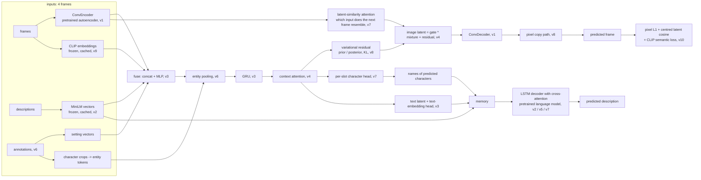

# Story continuation with a deep network, built one version at a time

Given four consecutive movie frames and their descriptions from a story in the
[StoryReasoning](https://huggingface.co/datasets/daniel3303/StoryReasoning) dataset, predict the
fifth frame (an image) and its description (text). This repository holds eleven versions of the
same architecture, `v0` to `v10`, each adding one idea to the previous one, so that the whole
system can be rebuilt as a sequence of exercises. Every version has a configuration you can read
in one screen, a training script that plots its curves, a visualisation script that renders
three seeds of predictions, and a README with a diagram and the numbers it should reach.

## The architecture at v10



## The versions

| version | adds | narrative level |
|---|---|---|
| `v0_floors` | the data, the floors every number is judged against, the cut / continue split | 0 |
| `v1_autoencoder` | the convolutional autoencoder that represents a frame | 1 |
| `v2_text` | the text language model (generation) and the frozen sentence encoder (inputs) | 2 |
| `v3_multimodal_fusion` | the first fully multimodal version: frame and text vectors fused, a GRU, latent-space prediction of the next frame and its description, the three classic fixes | 3 |
| `v4_attention` | content-dependent attention, mixture of input latents with a gate | 4 |
| `v5_protect` | pretrained language model, discriminative learning rates, reconstruction term, retrieval-based selection | 5 |
| `v6_annotations` | setting vectors, entity tokens, the "which characters appear next" head | 6 |
| `v7_names` | names in the text through cross-attention, per-slot character head, selection from frame similarities | 7 |
| `v8_variational` | a distribution over next frames (conditional VAE), the pixel copy path | 8 |
| `v9_scaling` | all frames, GroundCap pretraining, CLIP inputs, a wider decoder | 9 |
| `v10_semantic` | semantic metrics (CLIP similarity, Frechet, sharpness) and a contrastive CLIP loss with augmentations | 10 |

`docs/NARRATIVE.md` is the companion text: for each level the concept, what to build, what to
measure, the value reached here, the lesson and exercise ideas.

## Layout

```
v0_floors/ ... v10_semantic/   one directory per version: README.md, model.py, train.py, visualize.py, out/
storyseq/                      the shared package every version is assembled from
  components/                  autoencoder.py, text.py, attention.py, predictor.py, losses.py  (each documents its interface)
  data.py                      caches, windows, batches
  training.py                  the trainer: losses enabled by the configuration, evaluation with floors, curves, figures
  visualize.py                 figures for several seeds
  metrics.py                   CLIP similarity, CLIP Frechet distance, sharpness
  precompute/                  frames.py, annotations.py, groundcap.py, parsing.py  (build the caches once)
  pretrain_visual.py, pretrain_text.py
pretrained/                    weights written by v1 and v2 (not in git)
cache/                         tensors written by storyseq/precompute (not in git)
docs/NARRATIVE.md              the pedagogical text
tests/                         shape tests that build every version on random inputs
```

Versions v3 to v10 share one trainer and one model class; a version is a `PredictorConfig` (which
mechanisms are on) plus a `TrainConfig` (which losses and how to optimise), both written out in
its `model.py`. That is also where you inject your own component: `build_model(tok,
components={"context_attention": MyAttention})` replaces the default with any class that follows
the interface documented at the top of the corresponding file in `storyseq/components/`.

## Setup

```bash
python3.12 -m venv venv && source venv/bin/activate
pip install torch torchvision --index-url https://download.pytorch.org/whl/cu126   # or the CPU wheel
pip install -r requirements.txt

python -m storyseq.precompute.frames        # frames at 60x125, CLIP and MiniLM vectors (few minutes on a GPU)
python -m storyseq.precompute.annotations   # setting vectors, character crops, names (v6+)
python -m storyseq.precompute.groundcap     # 52k extra frames and captions for pretraining (v9+)

cd v1_autoencoder && python train.py && cd ..            # pretrained/visual_ae.pt
cd v2_text && python train.py && cd ..                   # pretrained/text_lm.pt
cd v4_attention && python train.py && python visualize.py
```

Every `train.py` accepts `--epochs`, `--batch-size`, `--lr`, `--seed`, `--tag`, `--device`,
`--no-plot` (skip the curves), `--no-semantic` (skip the CLIP table) and `--max-windows N` for a
dry run on a few windows. A full run of a version is 10 to 60 minutes on an 8 GB laptop GPU;
everything also runs on CPU, slowly. Outputs go to `<version>/out/`: the checkpoint (chosen on
validation retrieval) and the last epoch, `curves_*.png` with training losses and validation
metrics per epoch, `history_*.json`, `summary_*.json` with the test numbers and the semantic
table, and `predictions_*_seed{0,1,2}.png`.

## Weights

Trained weights for every version are published as assets of the GitHub release `weights-v1`
(not in git, to keep clones small): the v1 and v2 outputs (`pretrained/*.pt`) and one predictor
per version (`<version>/out/predictor_<version>.pt`, 100-160 MB each). Fetch what you need:

```bash
python -m storyseq.download_weights                          # everything
python -m storyseq.download_weights v4_attention --pretrained  # one version plus the pretrained parts
cd v4_attention && python visualize.py                       # figures without training
```

With the pretrained parts in place, every version's `train.py` reproduces its predictor in 10 to
90 minutes on a laptop GPU.

## How to read a run

The trainer prints, every epoch, the image L1 next to two floors (the median image and copy-last),
the reconstruction L1 of the fine-tuned autoencoder, the spread of predictions across inputs, the
retrieval of the true next frame and description among all validation targets, the text
cross-entropy with the true and with a shuffled condition, and, where the version has them, the
attention accuracy, the gate, the KL, the sample metrics and the character F1 against three
trivial baselines. A number without its floor is not a result; that rule is the one thing this
repository insists on.

## Branches

`main` is this student-facing layout and nothing else. The branch `development` keeps the full
history of how the architecture was arrived at: the original notebook and its first split into
modules, the diagnostics that found the failures, an embedding-space proof of concept, the `v2/`
experiment code with every run's log and figure, and two long documents, `ASSESSMENT.md` (what
was wrong and what each experiment showed) and `ARCHITECTURE_EVOLUTION.md` (the changes in the
order they happened). Read them if you want the story behind the levels; nothing on `main`
depends on them.
