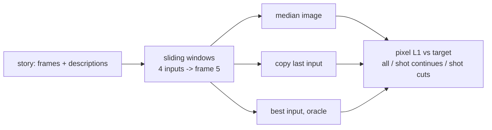

# v0: Data, floors and an honest metric

**Concept.** Before any model: what does a trivial predictor score? Without floors, a model that
outputs a constant looks like it is learning.



**What to run.** `python floors.py` after the caches exist (see the root README).

**What you should see** (test split, 60x125, pixel L1):

| predictor | all | shot continues (~15 %) | shot cuts (~85 %) |
|---|---|---|---|
| median image (the blob) | 0.15 | 0.11 | 0.15 |
| copy last input | 0.17 | 0.04 | 0.18 |
| best input (oracle) | 0.13 | 0.04 | 0.14 |

**The lesson.** On a cut, a real frame from the same story scores *worse* than the blob. Pixel L1
cannot reward plausibility; it rewards the average. Everything downstream is judged against these
numbers, and the whole path of versions is about seeing, measuring and working around this trap.

**Exercises.** Show that the median image beats copy-last. Find the share of windows where frame 3,
not frame 4, is the closest input (the A-B-A-B rhythm of dialogue editing). Change the threshold
that defines "shot continues" and see how the shares move.

**Files.** `floors.py`

**Run** (from this directory, with the venv active):

```bash
python floors.py
```

See `docs/NARRATIVE.md`, Level 0, for the full discussion and the numbers reached.
