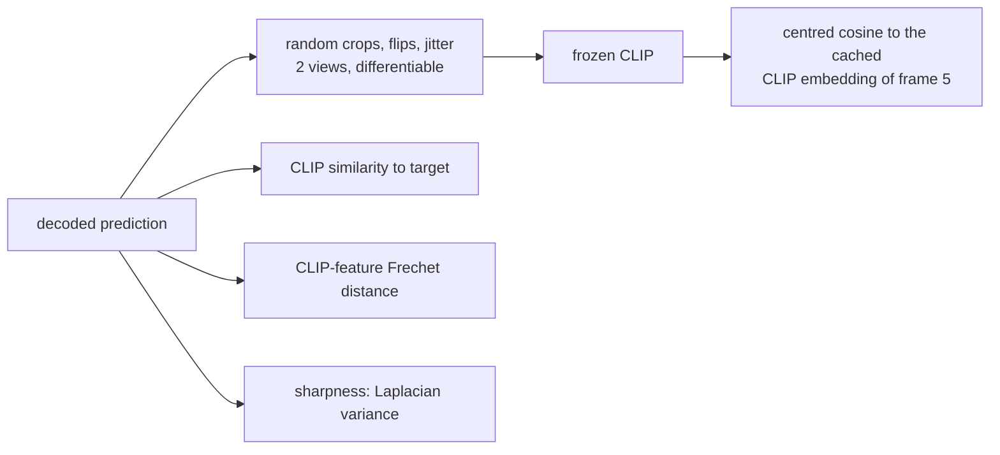

# v10: Measuring what the eye sees, and training for it

**Concept.** Metric validity: a metric must separate the outputs you can tell apart. Pixel L1 and
VGG feature distance cannot separate "right layout, blurred" from "right tint, no structure"; a
semantic embedding can. Then the same embedding as a loss.



**Configuration.** v9 plus `clip_loss_weight=0.5`, `clip_augment=True`. The trainer prints the
semantic table (`storyseq/metrics.py`) at the end of every version's run.

**What to measure** (test, before the loss): the prediction's CLIP similarity 0.06 against 0.00
for the blob and 0.37 for copy-last; sharpness 2 % of the target's. With the loss: similarity
0.25, sharpness 34 %, Frechet distance 0.33 -> 0.25, pixel L1 +0.002. Without augmentations the
decoder finds a repeated motif that raises the CLIP score; the augmentations remove it.

**The lesson.** Before trusting a metric, check that it separates the floors the way your eye
does. Copy-last at 0.37 shows why CLIP similarity rewards plausibility where every pixel or VGG
distance rewarded the blob.

**Exercises.** Compute the three measures for the floors. Plot CLIP similarity against pixel L1
over epochs. Train without `clip_augment` and find the artefact. Judge samples by Frechet distance
and by best-of-K and explain why they can disagree.

**Files.** `model.py` (the configuration and the injection point), `train.py`, `visualize.py`; outputs in `out/`: checkpoints, `curves_*.png` (training losses and validation metrics per epoch), `history_*.json`, `summary_*.json`, `predictions_*_seed{0,1,2}.png`

**Run** (from this directory, with the venv active):

```bash
python train.py            # 15 epochs; --max-windows 200 --epochs 1 for a dry run
python visualize.py        # three seeds of figures from the saved checkpoint
```

See `docs/NARRATIVE.md`, Level 10, for the full discussion and the numbers reached.
