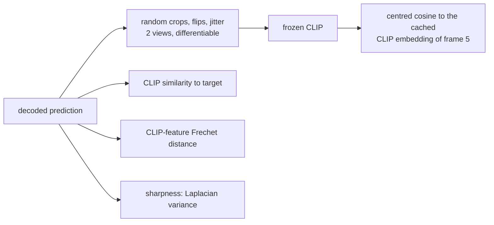

# v10: Measuring what the eye sees, and training for it

**Concept.** Metric validity: a metric must separate the outputs you can tell apart. Pixel L1 and
VGG feature distance cannot separate "right layout, blurred" from "right tint, no structure"; a
semantic embedding can. Then the same embedding as a loss.



**Configuration.** v9 plus `clip_loss_weight=0.2`, `clip_loss_mode="contrastive"`,
`clip_augment=True`. The contrastive form is InfoNCE over the batch: the prediction's CLIP
embedding must be closer to its own target's than to the other targets'. The absolute form
(`"cosine"`) is kept for the exercise below. The trainer prints the semantic table
(`storyseq/metrics.py`) at the end of every version's run.

**What to measure** (test, 5,254 windows). Before the loss (v9): the prediction's CLIP similarity
0.06 against 0.00 for the blob and 0.37 for copy-last; sharpness 2 % of the target's. With the
loss, two weights were run:

| CLIP weight | CLIP sim | sharpness | Frechet | pixel L1 | best of 5 | sample diversity | text R@10 |
|---|---|---|---|---|---|---|---|
| 0 (v9) | 0.06 | 0.02 | 0.33 | 0.132 | 0.124 | 0.11 | 51.7 % |
| 0.2 (shipped) | 0.24 | 0.29 | 0.22 | 0.136 | 0.128 | 0.07 | 43.8 % |
| 0.5 | 0.26 | 0.38 | 0.21 | 0.139 | 0.132 | 0.04 | 36.4 % |

The semantic gain is four times, at a cost that grows with the weight in pixel L1, sample
diversity and text retrieval; 0.2 keeps most of the gain for half the cost. And an open problem
to see for yourself in the figures: the decoder exploits the frozen CLIP. With the absolute
(cosine) loss it paints a fixed motif; with augmentations the motif becomes a translation-robust
template, a faint face in every scene; the contrastive form reduces but does not remove it,
because a face plus the scene's tint still tells targets apart on a film corpus.

**The lesson.** Before trusting a metric, check that it separates the floors the way your eye
does. Copy-last at 0.37 shows why CLIP similarity rewards plausibility where every pixel or VGG
distance rewarded the blob.

**Exercises.** Compute the three measures for the floors. Plot CLIP similarity against pixel L1
over epochs. Train with `clip_loss_mode="cosine"` and find the artefact, then add `clip_augment`
and find its successor. Propose and test a loss under which a generic face gains nothing. Judge samples by Frechet distance
and by best-of-K and explain why they can disagree.

**Files.** `model.py` (the configuration and the injection point), `train.py`, `visualize.py`; outputs in `out/`: checkpoints, `curves_*.png` (training losses and validation metrics per epoch), `history_*.json`, `summary_*.json`, `predictions_*_seed{0,1,2}.png`

**Run** (from this directory, with the venv active):

```bash
python train.py            # 15 epochs; --max-windows 200 --epochs 1 for a dry run
python visualize.py        # three seeds of figures from the saved checkpoint
```

See `docs/NARRATIVE.md`, Level 10, for the full discussion and the numbers reached.
