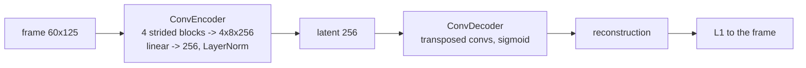

# v1: Representing a frame: the convolutional autoencoder

**Concept.** Reconstruction as pretraining; the latent as the currency the rest of the system
trades in; the reconstruction score as the ceiling any decoder-based prediction could reach.



**What to run.** `python train.py` (12 epochs, one minute on a laptop GPU). Writes
`pretrained/visual_ae.pt` and `pretrained/reconstructions.png`. Components in
`storyseq/components/autoencoder.py`.

**What to measure.** Validation reconstruction L1 against the median floor (reached 0.040 vs
0.152; 0.032 with `--width 2 --extra groundcap` in v9). Check that no latent unit is dead and
the latent spread is stable.

**The lesson.** A 16-d latent behind a ReLU dies; 256-d with LayerNorm does not. Reconstruction at
0.04 is the best any prediction through this decoder can do, and only if the predicted latent
equals the true one.

**Exercises.** Vary the latent width (16, 64, 256) and plot dead units and L1. Replace LayerNorm
with ReLU and watch the collapse. Interpolate between two latents and decode the path.

**Files.** `train.py` (wraps `storyseq/pretrain_visual.py`)

**Run** (from this directory, with the venv active):

```bash
python train.py            # writes pretrained/visual_ae.pt
```

See `docs/NARRATIVE.md`, Level 1, for the full discussion and the numbers reached.
