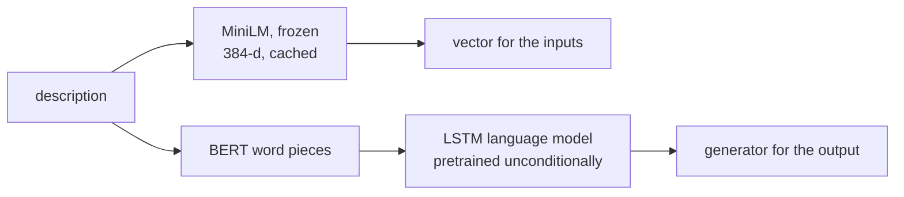

# v2: Representing a description: a language model and a frozen encoder

**Concept.** Two different jobs for text: *encoding* a description into a vector (for the inputs)
and *generating* one (for the output). Pretrained frozen components versus from scratch.



**What to run.** `python train.py` (8 epochs) writes `pretrained/text_lm.pt` and prints held-out
perplexity and samples; `--extra groundcap` adds 52k captions (v9). The MiniLM vectors are
produced by the cache step; the from-scratch LSTM encoder (`storyseq/components/text.py`) is the
comparison, selected with `text_encoder="lstm"` in any later version's CONFIG.

**What to measure.** Perplexity of the language model (17.9 on StoryReasoning alone, 13.0 with
GroundCap). Later, retrieval with each encoder: MiniLM gives about three times the text retrieval
of the from-scratch LSTM.

**The lesson.** The corpus has a house style: a third of the descriptions contain "the tension",
and greedy decoding of any model trained on it returns the modal sentence. Judge a conditional
model by numbers, and sample (nucleus, with a repetition penalty) to see what it knows.

**Exercises.** Count the most common 4-word openings. Decode greedily and by sampling from the
same model. Compare MiniLM and the LSTM encoder by nearest-neighbour retrieval of descriptions.

**Files.** `train.py` (wraps `storyseq/pretrain_text.py`)

**Run** (from this directory, with the venv active):

```bash
python train.py            # writes pretrained/text_lm.pt
```

See `docs/NARRATIVE.md`, Level 2, for the full discussion and the numbers reached.
