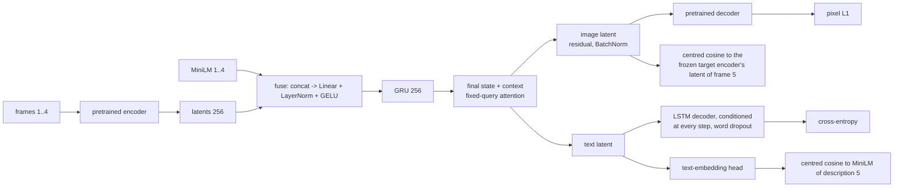

# v3: Fusion and a sequence model

**Concept.** Early fusion by concatenation; a GRU as the sequence summary; predicting in latent
space; why a shared vector gets captured by the strongest loss.



**Configuration.** `latent_mode="residual"`, `attention="fixed"`. Try `latent_mode="shared"` to
reproduce the failure where one vector serves every head.

**What to measure.** Image L1 vs floors; prediction spread across inputs (0 = the blob); retrieval
of the true next frame / description among all test targets (top-10, centred cosine); text
cross-entropy with the true vs a *shuffled* condition.

**The lessons** (each a classic). The decoder ignores its condition unless forced (word dropout,
text-embedding target). Encoder latents share a mean (raw cosine 0.31), so a raw cosine loss is
blind and a fine-tuned encoder satisfies it by shrinking toward the mean: centre the loss and take
the target from a frozen encoder. One vector for three heads makes the heads compete: separate
projections.

**Exercises.** Reproduce the shuffled-condition test. Measure the mean component of the latents
and what centring does. Train with `latent_mode="shared"` and compare both retrievals.

**Files.** `model.py` (the configuration and the injection point), `train.py`, `visualize.py`; outputs in `out/`: checkpoints, `curves_*.png` (training losses and validation metrics per epoch), `history_*.json`, `summary_*.json`, `predictions_*_seed{0,1,2}.png`

**Run** (from this directory, with the venv active):

```bash
python train.py            # 15 epochs; --max-windows 200 --epochs 1 for a dry run
python visualize.py        # three seeds of figures from the saved checkpoint
```

See `docs/NARRATIVE.md`, Level 3, for the full discussion and the numbers reached.
