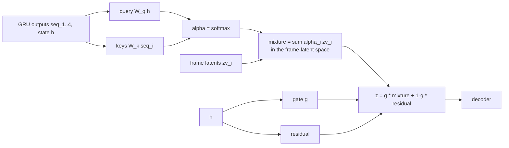

# v4: Attention that can select an input

**Concept.** Fixed-query attention (one importance profile for all inputs) versus content-dependent
attention (query from the state, keys from the sequence); a differentiable "copy one of the inputs"
via a mixture of latents and a learned gate.



**Configuration.** `latent_mode="mixture"`, `attention="content"`. The weights `alpha` and the gate
are returned by the model and printed on every figure.

**What to measure.** Mean alpha per input position; how often argmax(alpha) is the closest input on
near-copy windows (chance 25 %); the gate on near-copy vs cut windows.

**The lesson.** Without an explicit target the attention learns the positional prior (frame 3
highest) but not the per-window selection; the pixel gradient from 15 % of windows is too weak.
Supervising it from the GRU state works for selection but reshapes what the text heads read and
text retrieval collapses; v7 computes the selection from the frame latents instead.

**Exercises.** Plot alpha per window and look for A-B-A-B. Set `attn_weight=1.0` here and watch
text retrieval. Compute the ceiling of any selector (best-of-4 oracle from v0).

**Files.** `model.py` (the configuration and the injection point), `train.py`, `visualize.py`; outputs in `out/`: checkpoints, `curves_*.png` (training losses and validation metrics per epoch), `history_*.json`, `summary_*.json`, `predictions_*_seed{0,1,2}.png`

**Run** (from this directory, with the venv active):

```bash
python train.py            # 15 epochs; --max-windows 200 --epochs 1 for a dry run
python visualize.py        # three seeds of figures from the saved checkpoint
```

See `docs/NARRATIVE.md`, Level 4, for the full discussion and the numbers reached.
