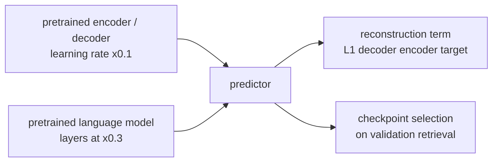

# v5: Protect what was pretrained

**Concept.** Fine-tuning drift; discriminative learning rates; keeping the pretraining objective
alive; selecting checkpoints on the right metric.



**Configuration.** `text_lm_weights`, `pretrained_lr_scale=0.1`, `text_lm_lr_scale=0.3`,
`recon_weight=1.0`, `cond_with_embedding=True` (the decoder also sees the predicted text embedding).

**What to measure.** The `recon_L1` monitor every epoch (pretrained reference 0.040); text
cross-entropy (2.75 with the pretrained language model vs 3.30 without).

**The lesson.** Lowering the learning rate does not stop the autoencoder from drifting (0.040 ->
0.080 after one epoch); only keeping the objective does (0.041). The pixel head overfits from epoch
1 while the other heads are still learning, so "best validation image L1" selects an untrained
model: select on retrieval, stop at 12-15 epochs.

**Exercises.** Log the reconstruction monitor with `recon_weight` 0 and 1. Plot every head's
validation curve (the trainer saves `history_*.json`) and find where each peaks.

**Files.** `model.py` (the configuration and the injection point), `train.py`, `visualize.py`; outputs in `out/`: checkpoints, `curves_*.png` (training losses and validation metrics per epoch), `history_*.json`, `summary_*.json`, `predictions_*_seed{0,1,2}.png`

**Run** (from this directory, with the venv active):

```bash
python train.py            # 15 epochs; --max-windows 200 --epochs 1 for a dry run
python visualize.py        # three seeds of figures from the saved checkpoint
```

See `docs/NARRATIVE.md`, Level 5, for the full discussion and the numbers reached.
