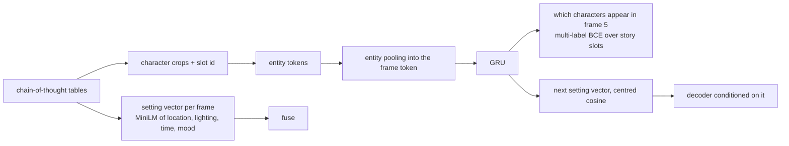

# v6: Using the annotations

**Concept.** Structured targets with honest baselines; entity tokens; set attention inside a
sequence model.



**Configuration.** `annotations=True` (cache built by `storyseq/precompute/annotations.py`).

**What to measure.** Character F1 at a calibrated threshold (0.3, since 1.6 of 7 slots are
positive) against three baselines the trainer prints: "same as frame 4", "everyone seen so far",
"present in at least two inputs".

**The lesson.** A head on the pooled sequence state learns the prior, not the pattern (0.41 vs
0.41 for "seen so far"); the per-character history is the signal, which v7 uses. Frame 3's
characters predict frame 5's better than frame 4's, the editing rhythm again.

**Exercises.** Compute the three baselines by hand. Calibrate the threshold on validation. Ablate
the entity tokens and the setting vector separately.

**Files.** `model.py` (the configuration and the injection point), `train.py`, `visualize.py`; outputs in `out/`: checkpoints, `curves_*.png` (training losses and validation metrics per epoch), `history_*.json`, `summary_*.json`, `predictions_*_seed{0,1,2}.png`

**Run** (from this directory, with the venv active):

```bash
python train.py            # 15 epochs; --max-windows 200 --epochs 1 for a dry run
python visualize.py        # three seeds of figures from the saved checkpoint
```

See `docs/NARRATIVE.md`, Level 6, for the full discussion and the numbers reached.
