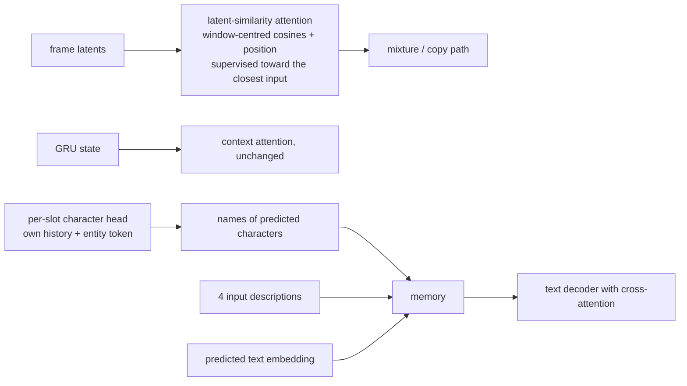

# v7: Names in the text, selection from the frames

**Concept.** Cross-attention over a memory in a recurrent decoder; conditioning through content
rather than a single vector; decoupling a mechanism from a shared state.



**Configuration.** `mix_attention="similarity"`, `attn_weight=1.0`, `per_slot_head=True`,
`text_memory=True`. Names come from the story's grounded mentions (cached with the annotations).

**What to measure.** Condition gap (true vs shuffled cross-entropy; reached 0.27-0.29 nats from
0.06), names appearing in the generated text, closest-input accuracy (44 %) with text retrieval
intact, character F1 (0.45).

**Exercises.** Ablate the memory (no names / no descriptions). Compare the coupled (v4 +
`attn_weight`) and decoupled attention on text retrieval.

**Files.** `model.py` (the configuration and the injection point), `train.py`, `visualize.py`; outputs in `out/`: checkpoints, `curves_*.png` (training losses and validation metrics per epoch), `history_*.json`, `summary_*.json`, `predictions_*_seed{0,1,2}.png`

**Run** (from this directory, with the venv active):

```bash
python train.py            # 15 epochs; --max-windows 200 --epochs 1 for a dry run
python visualize.py        # three seeds of figures from the saved checkpoint
```

See `docs/NARRATIVE.md`, Level 7, for the full discussion and the numbers reached.
