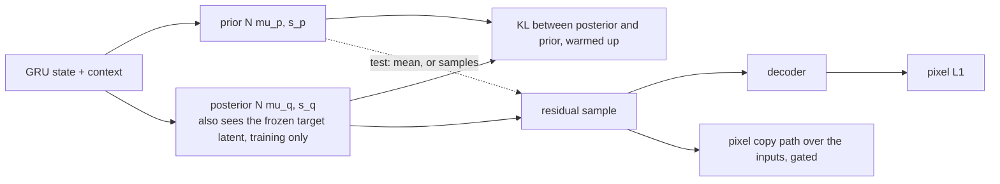

# v8: A distribution over next frames: the variational latent

**Concept.** Why sampling beats averaging on a multimodal target; the conditional-VAE recipe
(prior, posterior, reparameterisation, KL); the KL weight as the knob between "posterior leaks the
target" and "prior matches"; free bits.



**Configuration.** `latent_mode="variational"`, `kl_weight=1e-2`, `copy_path=True`.

**What to measure.** Prior-mean L1; best-of-5 and average-sample L1 against the blob; sample
diversity; posterior-sample L1; KL in nats.

| KL weight | KL | best of 5 | average sample (blob 0.151) | diversity |
|---|---|---|---|---|
| 1e-3 | 124 | 0.136 | 0.158 | 0.123 |
| 1e-2 | 10.8 | 0.125 | 0.146 | 0.094 |
| 3e-3 + free bits 0.1 | 55 | 0.133 | 0.159 | 0.127 |

**The lesson.** At 1e-3 the posterior carries the target and samples are composed but untied to
the inputs; at 1e-2 the average sample beats the blob and best-of-5 is below every deterministic
model. Sampling, not a new distance, turns averages into pictures; a VGG perceptual loss changed
nothing because no feature distance ranks a different shot above the blob.

**Exercises.** Sweep `kl_weight` and plot KL against best-of-5. Try `free_bits=0.1`. Show the
posterior-collapse test (posterior L1 vs prior-mean L1). Turn the copy path off and measure the
near-copy windows only.

**Files.** `model.py` (the configuration and the injection point), `train.py`, `visualize.py`; outputs in `out/`: checkpoints, `curves_*.png` (training losses and validation metrics per epoch), `history_*.json`, `summary_*.json`, `predictions_*_seed{0,1,2}.png`

**Run** (from this directory, with the venv active):

```bash
python train.py            # 15 epochs; --max-windows 200 --epochs 1 for a dry run
python visualize.py        # three seeds of figures from the saved checkpoint
```

See `docs/NARRATIVE.md`, Level 8, for the full discussion and the numbers reached.
