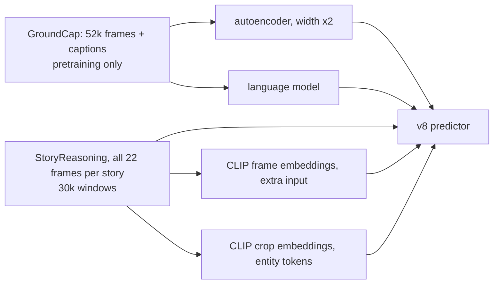

# v9: Scaling what has capacity

**Concept.** Data-limited versus capacity-limited; frozen pretrained features as the lever; using
the dataset a benchmark was built from.



**Configuration.** `clip_input=True`, `entity_features="clip"`, `ae_width=2`,
`ae_weights="pretrained/visual_ae_w2.pt"`. Needs the caches built with all frames and the two
pretraining runs with `--extra groundcap`.

**What to measure.** The v8 table plus the reconstruction reference of the wide autoencoder and
the perplexity of the language model trained on both corpora.

**What you should see.** Text retrieval up ten points (41.5 -> 51.6 %), text cross-entropy 2.65 ->
2.40, character F1 up two points, reconstruction 0.042 -> 0.036, and the image prediction
unchanged within 0.003. The parts that were data-limited moved; the part that is objective-limited
did not.

**Exercises.** Ablate each of the three scaling steps. Compare the wide and narrow autoencoder on
reconstruction and on the near-copy windows.

**Files.** `model.py` (the configuration and the injection point), `train.py`, `visualize.py`; outputs in `out/`: checkpoints, `curves_*.png` (training losses and validation metrics per epoch), `history_*.json`, `summary_*.json`, `predictions_*_seed{0,1,2}.png`

**Run** (from this directory, with the venv active):

```bash
python train.py            # 15 epochs; --max-windows 200 --epochs 1 for a dry run
python visualize.py        # three seeds of figures from the saved checkpoint
```

See `docs/NARRATIVE.md`, Level 9, for the full discussion and the numbers reached.
